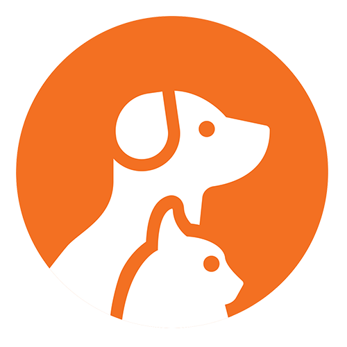

# Final Project :collision: Pet Adoption web-app - "WE🧡PETS" 
Deployed app (link)
## Summary
### :computer: Frontend
 * **UI Frameword**: React
 * **CSS and styling**: MUI + "Styled Components"
 * **State Management**: Redux
 * **Hosting**: AWS S3
### :file_folder: Backend
* **Framework**: Node.js
* **Main Libraries**: Express, JWT, AJV, Mongoose
* **DB**: MondgoDB
### Tests

## :clipboard: Stages
### 1. **Frontend**: Basic UI without bussiness logic :white_check_mark:
### 2. **Backend**: MVC Structure + write all endpoints/routes :white_check_mark:
### 3. **Backend**: Write the controllers
### 4. **Frontend**: Finish UI

### :basketball: Vadim Gringauz :basketball:
